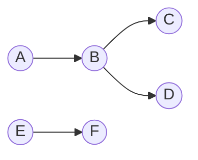
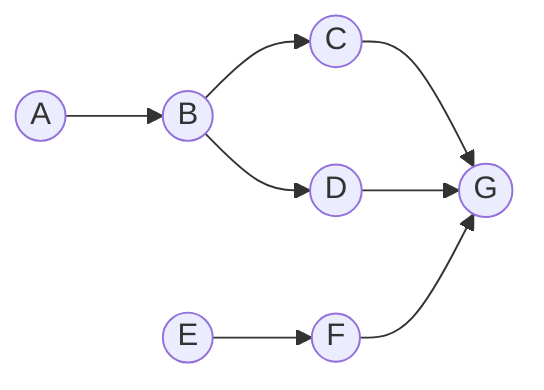

# prio-graph 

A library for building a directed acyclic graph that is lazily evaluated as new transactions are added.
Edges are only present for the next-highest priority conflict for a particular resource, with the caveat that
insertion order takes precedence over priority.

The `PrioGraph` structure keeps track of the nodes in the graph, the directed edges between them, a main queue, and
mappings for distinct "chains" of transaction. For example:

`A` and `E` have no conflicts and are the highest priority items within their prospective chains.
These node's associated ids would be in the main queue, and would have different chain ids.
If a transaction were added that conflicts with both chains, then these chains would be joined, and a mapping of joined
chains is tracked in the `PrioGraph`.

