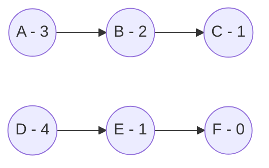
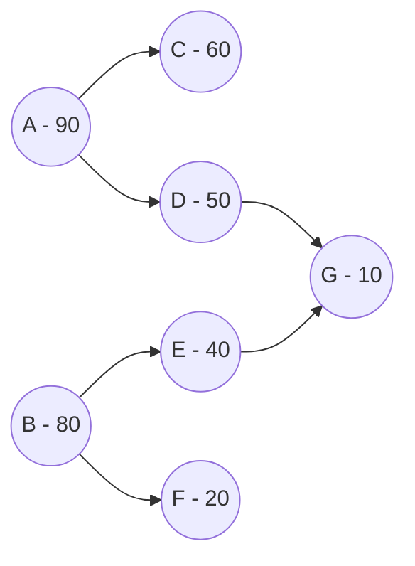

# prio-graph 

Provides an interface for building a directed acyclic graph from prioritized transactions that lock resources.
An edge from a node is only present for the next-highest priority conflicts for a particular resource.

Generates the "natural batches", which are iterative batches consisting of all unblocked transaction ids for
each iteration.

# Example - Distinct Lock Usage

Let's say we have 3 transactions writing an account `1`: A, B, C with priorites 3, 2, and 1, respectively.
And 3 transactions writing an account `2`: D, E, F with priorites 4, 1, and 0, respectively.

The prio-graph produced can be represented by the following:


which would produce natural batches: `[A, D], [B, E], [C, F]`.

# Example - Forking and Joining

A more realistic example will look at resources that are shared by transactions, where some transaction use a resource and others may not.

Let's take another scenario with transactions:
```
Tx: priority - (accounts)
A:  90 - (1, 2)
B:  80 - (3, 4)
C:  60 - (1)
D:  50 - (2)
E:  40 - (3)
F:  20 - (4)
G:  10 - (2, 3)
```

This results in a prio-graph:

and the natural batches become: `[A, B], [C, D, E, F], [G]`
